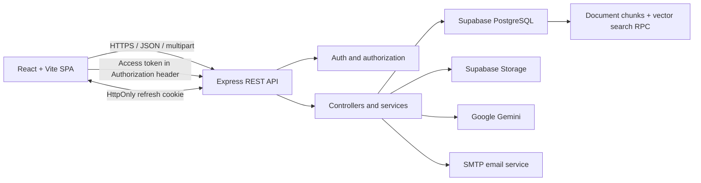
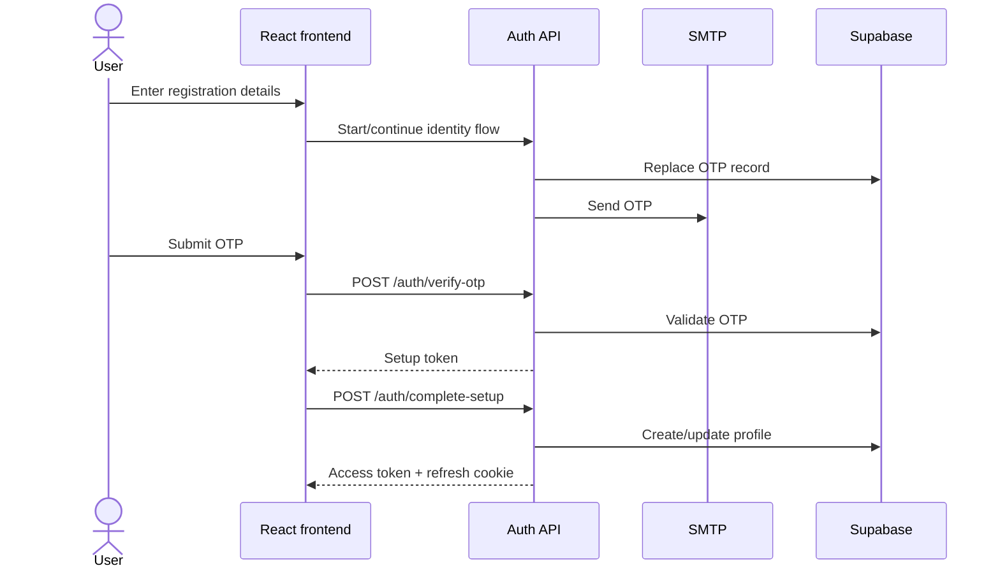
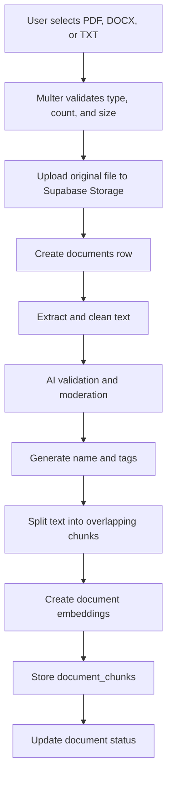

# AI StudyHub — Project Documentation

## Table of Contents

1. [Project Overview](#project-overview)
2. [Goals and Scope](#goals-and-scope)
3. [Current Capabilities](#current-capabilities)
4. [Architecture](#architecture)
5. [Repository Structure](#repository-structure)
6. [Frontend Design](#frontend-design)
7. [Backend Design](#backend-design)
8. [Core Workflows](#core-workflows)
9. [Authentication and Authorization](#authentication-and-authorization)
10. [API Reference](#api-reference)
11. [Data and Storage Model](#data-and-storage-model)
12. [AI Pipeline](#ai-pipeline)
13. [Configuration](#configuration)
14. [Local Development](#local-development)
15. [Testing and Verification](#testing-and-verification)
16. [Deployment Guidance](#deployment-guidance)
17. [Security Considerations](#security-considerations)
18. [Current Constraints and Technical Debt](#current-constraints-and-technical-debt)
19. [Troubleshooting](#troubleshooting)
20. [Recommended Next Steps](#recommended-next-steps)

## Project Overview

AI StudyHub is a web application that combines document management, collaborative learning spaces, and generative AI study tools. Users can create libraries, upload study documents, organize and share material, ask questions grounded in uploaded content, and generate flashcards. Administrators can moderate content, manage users, review activity, and inspect platform usage.

The application uses a client/server architecture:

- The frontend is a React single-page application.
- The backend is an Express REST API.
- Supabase provides PostgreSQL data access and object storage.
- Google Gemini provides text generation, content analysis, and embeddings.
- SMTP email supports OTP verification and password recovery.

## Goals and Scope

The implemented product supports four primary audiences:

| Audience | Purpose |
| --- | --- |
| Guest | Browse public libraries and public user-facing content |
| Registered user | Maintain libraries, upload documents, use AI tools, and manage a profile |
| Workspace member | Collaborate inside workspaces according to membership role |
| System administrator | Moderate documents, manage accounts, inspect logs, and monitor usage |

The system’s main domain areas are:

- Identity and session management
- Personal and public document libraries
- Workspace collaboration
- Document extraction and storage
- AI-assisted study features
- Content moderation
- Platform administration

## Current Capabilities

### Identity and profiles

- Google sign-in
- Email/OTP verification
- Username and password setup
- Password login
- Forgot-password OTP flow
- Refreshable login sessions
- Single-active-session enforcement through `session_id`
- User search and profile lookup
- Active/disabled account status
- `USER`, `GUEST`, and `SYSTEM_ADMIN` application roles

### Libraries and documents

- Create, list, view, update, and delete libraries
- Public/private library visibility
- List documents by library
- Upload up to 10 documents per request
- PDF, DOCX, and TXT validation
- Supabase Storage upload and signed download URLs
- Tags and AI-generated metadata
- Document deletion and related chunk cleanup
- Public library and public document download endpoints

### Workspaces

- Create and list a user’s workspaces
- View, rename, and delete a workspace
- List members
- Search eligible users
- Add members as `Editor` or `Viewer`
- Automatically assign the creator as `Admin`
- Restrict workspace administration to workspace admins

### AI study tools

- Extract text from PDF, DOCX, and TXT
- Split extracted text into overlapping chunks
- Generate document embeddings
- Store embeddings for semantic retrieval
- Ask questions against relevant document chunks
- Generate flashcards from a document
- Generate suggested tags and document names
- Detect sensitive or disallowed content
- Track AI usage

### Administration

- Dashboard metrics
- Moderation queue
- Approve/reject document decisions
- User listing and search
- Enable/disable user accounts
- Activity log reporting
- Storage and AI usage reporting

## Architecture



### Request path

1. React pages call a frontend API wrapper.
2. The shared Axios instance applies the configured API base URL.
3. The request interceptor attaches the access token.
4. Express routes apply authentication and role middleware where required.
5. Controllers validate input and coordinate Supabase or service calls.
6. Services handle specialized work such as email, extraction, embeddings, or AI generation.
7. The API responds with JSON, normally using `status`, `message`, and `data`.
8. On an eligible `401`, the frontend tries one refresh and retries the original request.

## Repository Structure

```text
AI-student-hub/
├── BE/
│   ├── .env                     # Backend secrets; not for source control
│   ├── package.json
│   ├── server.js                # Express bootstrap and route mounting
│   └── src/
│       ├── config/
│       │   └── supabase.js
│       ├── controllers/
│       │   ├── adminController.js
│       │   ├── aiController.js
│       │   ├── authController.js
│       │   ├── documentController.js
│       │   ├── publicController.js
│       │   └── workspaceController.js
│       ├── middleware/
│       │   ├── authMiddleware.js
│       │   └── requireAdmin.js
│       ├── routes/
│       │   ├── adminRoutes.js
│       │   ├── aiRoutes.js
│       │   ├── authRoutes.js
│       │   ├── documentRoutes.js
│       │   ├── publicRoutes.js
│       │   └── workspaceRoutes.js
│       ├── services/
│       │   ├── activityLogService.js
│       │   ├── aiService.js
│       │   ├── authService.js
│       │   └── textExtractService.js
│       └── utils/
│           └── authHelpers.js
├── FE/
│   ├── .env                     # Public Vite-time configuration
│   ├── package.json
│   ├── vite.config.js
│   ├── public/
│   └── src/
│       ├── App.jsx              # Application route tree
│       ├── main.jsx
│       ├── index.css
│       ├── assets/
│       ├── components/
│       │   ├── common/
│       │   ├── layout/
│       │   └── pages/
│       ├── context/
│       │   └── ThemeContext.jsx
│       └── utils/
│           ├── adminApi.js
│           ├── aiApi.js
│           ├── api.js
│           ├── authToken.js
│           ├── documentApi.js
│           ├── notificationStore.js
│           ├── publicApi.js
│           ├── searchApi.js
│           └── workspaceApi.js
├── tools/srs_rewrite/           # SRS evidence and document-generation tooling
├── output/                      # Generated artifacts; not application runtime code
├── PROJECT_DOCUMENTATION.md
├── README.md
├── LICENSE
└── package.json                 # Minimal root dependency manifest
```

## Frontend Design

### Routing

`FE/src/App.jsx` defines three route groups.

#### Public identity routes

- `/`
- `/login`
- `/register`
- `/verify-otp`
- `/otp-verification`
- `/complete-profile`
- `/enter-username-password`
- `/forgot-password`
- `/reset-password`
- `/reset-password-otp`

#### User dashboard routes

- `/dashboard/home`
- `/dashboard/libraries`
- `/dashboard/create-library`
- `/dashboard/import-library`
- `/dashboard/libraries/:libraryId`
- `/dashboard/workspaces`
- `/dashboard/create-workspace`
- `/dashboard/workspaces/:workspaceId`
- `/dashboard/profile`
- `/dashboard/profile/:id`
- `/dashboard/settings`
- `/dashboard/flashcards`
- `/dashboard/search-user`
- `/dashboard/search`

#### Administrator routes

- `/admin/dashboard`
- `/admin/moderation`
- `/admin/users`
- `/admin/logs`
- `/admin/usage`
- `/admin/settings`
- `/admin/profile`

Unknown routes redirect to `/`.

### API layer

`FE/src/utils/api.js` is the central HTTP client. It:

- Uses `VITE_API_BASE_URL`, defaulting to `http://localhost:5000/api`
- Enables cross-origin credentials
- Reads the access token from `localStorage`
- Adds the Bearer token to outgoing requests
- Deduplicates concurrent refresh requests
- Retries an eligible failed request once after token refresh
- Clears local session data and redirects to `/login` when recovery fails

Domain wrappers separate endpoint details from pages:

| File | Responsibility |
| --- | --- |
| `documentApi.js` | Documents and personal libraries |
| `workspaceApi.js` | Workspace CRUD and membership |
| `publicApi.js` | Guest/public library access |
| `aiApi.js` | Document-grounded chat |
| `adminApi.js` | Administrative operations |
| `searchApi.js` | User search |

### Client-side state

The application primarily uses:

- React component state and effects
- React Router navigation state
- `localStorage` for the access token, public user data, theme, avatar, display name, and selected preferences
- An HttpOnly browser cookie for the refresh token

There is no global Redux-style store in the current implementation.

## Backend Design

### Server bootstrap

`BE/server.js`:

- Loads `.env` with `dotenv`
- Creates the Express application
- Configures CORS with credentials
- Enables JSON request parsing
- Mounts six API route groups
- Exposes a root health message
- Listens on `PORT`, defaulting to `5000`

Mounted API groups:

| Prefix | Purpose |
| --- | --- |
| `/api/auth` | Registration, login, sessions, password recovery, profiles |
| `/api/documents` | Authenticated libraries and documents |
| `/api/ai` | Chat and flashcard generation |
| `/api/admin` | System administration |
| `/api/workspaces` | Collaborative workspace management |
| `/api/public` | Anonymous public-library access |

### Layer responsibilities

| Layer | Responsibility |
| --- | --- |
| Routes | HTTP method/path mapping and route middleware |
| Middleware | Access-token validation and system-admin enforcement |
| Controllers | Validation, orchestration, response construction |
| Services | AI, email/auth integration, extraction, activity logging |
| Configuration | Supabase client construction |
| Utilities | JWT, hashing, normalization, OTP, and validation helpers |

## Core Workflows

### Email registration



OTP validity is 10 minutes. Setup and password-reset tokens are valid for 15 minutes.

### Login and refresh

1. The user signs in with credentials or Google.
2. The backend creates a new `session_id` for the active login.
3. The backend returns a 30-minute access token.
4. The backend writes a 30-day refresh token to an HttpOnly cookie.
5. The frontend stores the access token and public user object locally.
6. Protected requests send the access token in the Authorization header.
7. When the access token expires, the Axios client calls `/api/auth/refresh`.
8. The backend validates the refresh token and current `session_id`.
9. A newer login invalidates an older session because the stored `session_id` no longer matches.

### Document upload and processing



Backend upload constraints:

- Accepted extensions: `.pdf`, `.docx`, `.txt`
- Accepted MIME types: PDF, DOCX, plain text
- Maximum files per request: 10
- Maximum size per file: 20 MB
- Multer uses memory storage before the file is sent to Supabase Storage

### Document chat

1. The user selects an accessible document and submits a question.
2. The backend verifies that the document belongs to the user or an accessible workspace.
3. AI usage is checked and incremented.
4. The question is embedded in query mode.
5. Supabase calls the `match_document_chunks` RPC.
6. The most relevant chunks are passed to Gemini as context.
7. The generated answer is returned to the frontend.

### Flashcard generation

1. The backend verifies document access.
2. Stored document chunks are loaded.
3. Gemini generates structured question/answer cards.
4. Existing flashcards for that document are deleted.
5. New flashcards are inserted and returned.

### Workspace collaboration

1. A user creates a workspace.
2. The creator receives an `Admin` membership row.
3. An admin searches users outside the workspace.
4. The admin adds a user as `Editor` or `Viewer`.
5. Members can view workspace details.
6. Only a workspace admin can add members, rename, or delete the workspace.

### Administrative moderation

1. `authMiddleware` validates the request and current session.
2. `requireAdmin` requires application role `SYSTEM_ADMIN`.
3. The moderation endpoint returns documents requiring review.
4. An administrator submits a decision and optional reason.
5. The document status is updated and an activity entry can be recorded.
6. Dashboard and usage endpoints aggregate current platform data.

## Authentication and Authorization

### Token model

| Credential | Storage | Lifetime | Purpose |
| --- | --- | --- | --- |
| Access token | Frontend `localStorage` | 30 minutes | Bearer authentication for protected APIs |
| Refresh token | HttpOnly cookie | 30 days | Obtain a new access token |
| Setup token | API response/client flow | 15 minutes | Complete a verified registration |
| Password-reset token | API response/client flow | 15 minutes | Authorize password reset |
| OTP | `otp_tokens` table | 10 minutes | Verify email ownership |

In development, the refresh cookie uses `SameSite=Lax` and does not require HTTPS. In production, it uses `SameSite=None` and `Secure`.

### Application roles

| Role | Access |
| --- | --- |
| `GUEST` | Limited guest-compatible dashboard routes and public data |
| `USER` | Normal authenticated user functionality |
| `SYSTEM_ADMIN` | Administrator UI and all `/api/admin` endpoints |

### Workspace roles

| Role | Meaning |
| --- | --- |
| `Admin` | Workspace administration and membership management |
| `Editor` | Collaborative member role |
| `Viewer` | Read-oriented member role |

Application roles and workspace roles are separate concepts and use different casing.

## API Reference

The default base URL is `http://localhost:5000/api`.

Legend:

- Public: no Bearer token required by the route
- User: valid access token required
- Admin: valid access token and `SYSTEM_ADMIN` role required

### Authentication and profiles

| Method | Path | Access | Purpose |
| --- | --- | --- | --- |
| POST | `/auth/google` | Public | Authenticate with a Google credential |
| POST | `/auth/verify-otp` | Public | Verify registration OTP |
| GET | `/auth/check-username` | Public | Check username availability |
| POST | `/auth/complete-setup` | Public | Complete account setup |
| POST | `/auth/login` | Public | Password login |
| POST | `/auth/refresh` | Cookie | Issue a new access token |
| POST | `/auth/logout` | Cookie | Clear refresh state and cookie |
| POST | `/auth/forgot-password` | Public | Send password-reset OTP |
| POST | `/auth/verify-reset-otp` | Public | Verify password-reset OTP |
| POST | `/auth/reset-password` | Public | Set a new password with reset token |
| GET | `/auth/search` | Public route | Search user profiles |
| GET | `/auth/users/:id/profile` | Public route | Load a public user profile |

### Documents and libraries

| Method | Path | Access | Purpose |
| --- | --- | --- | --- |
| GET | `/documents` | User | List accessible personal documents; accepts `libraryId` |
| POST | `/documents/upload` | User | Upload one or more documents |
| GET | `/documents/libraries` | User | List the user’s libraries |
| GET | `/documents/libraries/:libraryId` | User | Get one library |
| POST | `/documents/libraries` | User | Create a library |
| PUT | `/documents/libraries/:id` | User | Update a library |
| DELETE | `/documents/libraries/:id` | User | Delete a library |
| GET | `/documents/:documentId/download` | User | Create a signed download URL |
| DELETE | `/documents/:documentId` | User | Delete a document |

### AI

| Method | Path | Access | Purpose |
| --- | --- | --- | --- |
| POST | `/ai/chat` | User | Ask a question grounded in a document |
| POST | `/ai/documents/:documentId/flashcards` | User | Generate and save flashcards |

### Workspaces

| Method | Path | Access | Purpose |
| --- | --- | --- | --- |
| GET | `/workspaces` | User | List the user’s workspaces |
| POST | `/workspaces` | User | Create a workspace |
| GET | `/workspaces/:workspaceId` | Member | Get a workspace |
| PUT | `/workspaces/:workspaceId` | Workspace admin | Update a workspace |
| DELETE | `/workspaces/:workspaceId` | Workspace admin | Delete a workspace |
| GET | `/workspaces/:workspaceId/members` | Member | List members |
| GET | `/workspaces/:workspaceId/users/search` | Workspace admin | Find users to add |
| POST | `/workspaces/:workspaceId/members` | Workspace admin | Add an editor or viewer |

### Public access

| Method | Path | Access | Purpose |
| --- | --- | --- | --- |
| GET | `/public/libraries` | Public | List public libraries |
| GET | `/public/libraries/:libraryId` | Public | View a public library |
| GET | `/public/documents/:documentId/download` | Public | Create a public-document signed URL |

### Administration

| Method | Path | Access | Purpose |
| --- | --- | --- | --- |
| GET | `/admin/dashboard` | Admin | Aggregate dashboard statistics |
| GET | `/admin/moderation` | Admin | List documents for moderation |
| PATCH | `/admin/moderation/:documentId` | Admin | Review a document |
| GET | `/admin/users` | Admin | List/search users |
| PATCH | `/admin/users/:userId/status` | Admin | Enable or disable a user |
| GET | `/admin/logs` | Admin | Get activity logs |
| GET | `/admin/usage` | Admin | Get storage and AI usage |

## Data and Storage Model

No database migration or schema file is checked into the current repository. The backend assumes that a compatible Supabase project has already been provisioned.

Tables referenced directly by the code:

| Table | Purpose |
| --- | --- |
| `profiles` | User identity, password hash, role, status, and active session |
| `otp_tokens` | Registration and password-reset OTP records |
| `libraries` | Personal/public library metadata |
| `documents` | File metadata, ownership, library/workspace links, status |
| `tags` | Reusable tag definitions |
| `document_tags` | Document-to-tag junction |
| `document_chunks` | Extracted chunks and embeddings |
| `flashcards` | Generated question/answer cards |
| `workspaces` | Collaborative workspace metadata |
| `workspace_members` | User membership and workspace role |
| `activity_logs` | Administrative/audit activity |
| `daily_quota_usage` | Per-user daily quota accounting |
| `ai_usage_logs` | AI usage records |

External Supabase objects:

- Storage bucket configured by `SUPABASE_DOCUMENT_BUCKET`, default `documents`
- PostgreSQL RPC named `match_document_chunks`
- Vector-capable embedding column and compatible query function
- Appropriate table constraints, indexes, and access policy

Because the backend uses the Supabase service-role key, authorization is primarily enforced in application code. Database policies should still follow least-privilege principles.

## AI Pipeline

### Models

| Purpose | Configuration | Default |
| --- | --- | --- |
| Text generation | `GEMINI_TEXT_MODEL` | `gemini-2.5-flash` |
| Embeddings | `GEMINI_EMBEDDING_MODEL` | `gemini-embedding-001` |

### AI service responsibilities

`BE/src/services/aiService.js` provides:

- Gemini client initialization
- JSON extraction from model responses
- Text generation
- Document moderation
- Embedding creation
- Vector serialization
- Context-grounded answers
- Flashcard generation
- Suggested tags and names
- Sensitive-content checks
- Tag/content validation

Changing the embedding model can change vector dimensions or semantics. Existing `document_chunks` should be re-embedded when switching to an incompatible model, and the database vector column/RPC must match the selected model.

## Configuration

### Backend environment variables

| Variable | Required | Description |
| --- | --- | --- |
| `PORT` | No | API port; defaults to `5000` |
| `NODE_ENV` | Recommended | Enables production cookie security when set to `production` |
| `FRONTEND_URL` | Recommended | Additional allowed CORS origin |
| `SUPABASE_URL` | Yes | Supabase project URL |
| `SUPABASE_SERVICE_ROLE_KEY` | Yes | Privileged backend Supabase key |
| `SUPABASE_DOCUMENT_BUCKET` | No | Storage bucket; defaults to `documents` |
| `JWT_SECRET` | Yes | Secret used for all JWT variants |
| `GOOGLE_CLIENT_ID` | For Google login | OAuth audience |
| `EMAIL_HOST` | For email flows | SMTP hostname |
| `EMAIL_PORT` | For email flows | SMTP port; defaults to `2525` |
| `EMAIL_USER` | For email flows | SMTP username/from address |
| `EMAIL_PASS` | For email flows | SMTP password |
| `GEMINI_API_KEY` | For AI flows | Gemini API credential |
| `GEMINI_TEXT_MODEL` | No | Gemini generation model |
| `GEMINI_EMBEDDING_MODEL` | No | Gemini embedding model |

### Frontend environment variables

| Variable | Required | Description |
| --- | --- | --- |
| `VITE_API_BASE_URL` | No | API root; defaults to `http://localhost:5000/api` |

Only variables prefixed with `VITE_` are exposed to frontend code. Never place secrets in `FE/.env`.

## Local Development

### Install

```bash
cd BE
npm install

cd ../FE
npm install
```

### Run

Terminal 1:

```bash
cd BE
node server.js
```

Terminal 2:

```bash
cd FE
npm run dev
```

Expected local addresses:

- Frontend: `http://localhost:5173`
- Backend: `http://localhost:5000`
- API root: `http://localhost:5000/api`

The backend CORS list includes localhost and `127.0.0.1` on ports 5173 and 5174, plus `FRONTEND_URL` when configured.

## Testing and Verification

### Frontend

```bash
cd FE
npm run lint
npm run build
```

The build verifies that Vite can compile the current frontend. Lint is a separate quality gate and may identify issues that do not prevent bundling.

### Backend

```bash
cd BE
node --check server.js
npm test
```

Jest is configured to discover `BE/tests/**/*.test.js`. Test effectiveness depends on the tests present in that directory and on any required environment setup.

### Suggested smoke test

1. Confirm `GET http://localhost:5000/` responds.
2. Open the landing page.
3. Register or log in.
4. Refresh the browser and confirm the session is restored.
5. Create a library.
6. Upload a small TXT file.
7. Confirm processing reaches a stable document status.
8. Download the file.
9. Ask a document-grounded question.
10. Generate flashcards.
11. Create a workspace and add another user.
12. Sign in as a system admin and verify each admin page loads live data.

## Deployment Guidance

### Frontend

1. Set `VITE_API_BASE_URL` to the deployed API URL before building.
2. Replace hard-coded local API URLs in chatbot and flashcard pages.
3. Move the Google client ID to frontend environment configuration.
4. Run `npm run build`.
5. Deploy `FE/dist` to a static host with SPA fallback to `index.html`.

### Backend

1. Provide all backend environment variables through the hosting platform.
2. Set `NODE_ENV=production`.
3. Set `FRONTEND_URL` to the exact frontend origin.
4. Serve the API over HTTPS.
5. Start the service with `node server.js` or add a production `start` script/process manager.
6. Confirm the platform forwards cookies and Authorization headers.

### Supabase

1. Create the required tables and relationships.
2. Create the document storage bucket.
3. Create the vector extension/column and `match_document_chunks` RPC.
4. Add indexes for ownership, status, membership, and vector retrieval.
5. Configure backup, retention, and storage policies.
6. Keep the service-role key backend-only.

## Security Considerations

- Never expose `SUPABASE_SERVICE_ROLE_KEY`, `JWT_SECRET`, SMTP credentials, or `GEMINI_API_KEY`.
- Use a long, random JWT secret and rotate it through a controlled process.
- Production refresh cookies require HTTPS because they use `Secure`.
- Access tokens in `localStorage` are exposed to successful cross-site scripting; keep dependencies current and avoid unsafe HTML injection.
- Validate authorization in every controller that accesses user-owned or workspace-owned data.
- The current `/auth/search` and `/auth/users/:id/profile` routes do not apply auth middleware; review whether that exposure is intentional.
- Add rate limiting to login, OTP, password reset, search, upload, and AI endpoints.
- Do not log credentials, JWTs, OTPs, private document content, or service keys.
- Validate generated signed URLs with short expiry and correct ownership/visibility checks.
- Apply database constraints in addition to application validation.

## Current Constraints and Technical Debt

The following items are visible in the current source and should be understood before production deployment:

1. **Schema provisioning is external.** Required tables, migrations, storage setup, and the vector-search RPC are not included.
2. **Two frontend AI pages use hard-coded local URLs.** `ChatBot.jsx` and `Flashcards.jsx` bypass the shared configurable API base.
3. **Google OAuth configuration is source-coded in the frontend.** This should use a `VITE_` environment variable.
4. **Upload limits disagree.** Some frontend validation and UI use 50 MB, while the backend rejects files over 20 MB.
5. **The backend has no `start` or development script.** It is launched directly with `node server.js`.
6. **The root package is not an orchestrator.** It does not install or start both applications.
7. **Some settings sections are explicitly planned UI.** They should not be treated as persisted server functionality without further implementation.
8. **API validation is controller-specific.** A shared schema-validation layer is not present.
9. **No global Express error middleware is mounted.** Error response shape can vary by route or Multer failure.
10. **Rate limiting is not present.** Auth, email, upload, and AI endpoints need abuse protection.
11. **Automated coverage is not demonstrated by configuration alone.** The backend declares Jest, but meaningful coverage depends on checked-in tests.
12. **Source text contains encoding artifacts in some messages/comments.** Normalize affected files to UTF-8 to avoid garbled Vietnamese text.

## Troubleshooting

### Frontend cannot reach the API

- Verify the backend is listening on port 5000.
- Check `VITE_API_BASE_URL`.
- Restart Vite after changing `FE/.env`.
- Confirm the frontend origin is allowed by backend CORS.
- Check that local AI pages are not still calling a different hard-coded host.

### Login works but refresh fails

- Confirm frontend requests use credentials.
- Confirm the browser accepted the `refreshToken` cookie.
- Verify frontend and backend origins match the cookie/CORS deployment design.
- In production, verify HTTPS is enabled.
- Check that the user’s current `session_id` matches the token.

### Upload is rejected

- Use PDF, DOCX, or TXT.
- Keep each file under 20 MB.
- Upload no more than 10 files per request.
- Verify file extension and MIME type agree.
- Confirm the Supabase bucket exists and the backend key can write to it.

### AI processing fails

- Verify `GEMINI_API_KEY`.
- Confirm the configured model names are available to the account.
- Confirm extracted text is non-empty.
- Confirm the embedding vector size matches the database column and RPC.
- Verify `match_document_chunks` exists.
- Review quota data and AI usage logs.

### OTP email is not delivered

- Verify SMTP host, port, username, and password.
- Confirm the provider permits the configured sender.
- Check spam/junk folders.
- Review backend output without exposing credentials or OTP values.

### Admin endpoint returns 403

- Confirm the access token is valid.
- Confirm the profile role is exactly `SYSTEM_ADMIN`.
- Confirm the account is not disabled.

## Recommended Next Steps

1. Add versioned Supabase migrations and seed/setup instructions.
2. Add safe `.env.example` files for `BE` and `FE`.
3. Replace hard-coded API and Google OAuth configuration.
4. Align upload limits across frontend and backend.
5. Add backend `start` and `dev` scripts and optional root orchestration.
6. Add request validation with a consistent error format.
7. Add rate limiting, security headers, and structured logging.
8. Add automated tests for authentication, authorization, document ownership, workspace roles, and admin actions.
9. Add continuous integration for backend tests, frontend lint, and frontend build.
10. Normalize source files to UTF-8 and clean garbled user-facing messages.
11. Document production hosting, database backups, and secret rotation.
12. Add health/readiness endpoints that verify critical dependencies separately.

## License

AI StudyHub is distributed under the MIT License. See [LICENSE](LICENSE).
